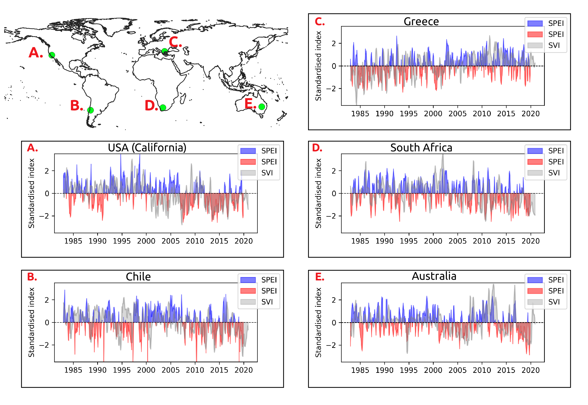
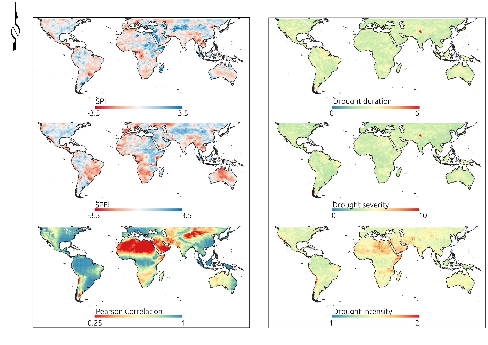
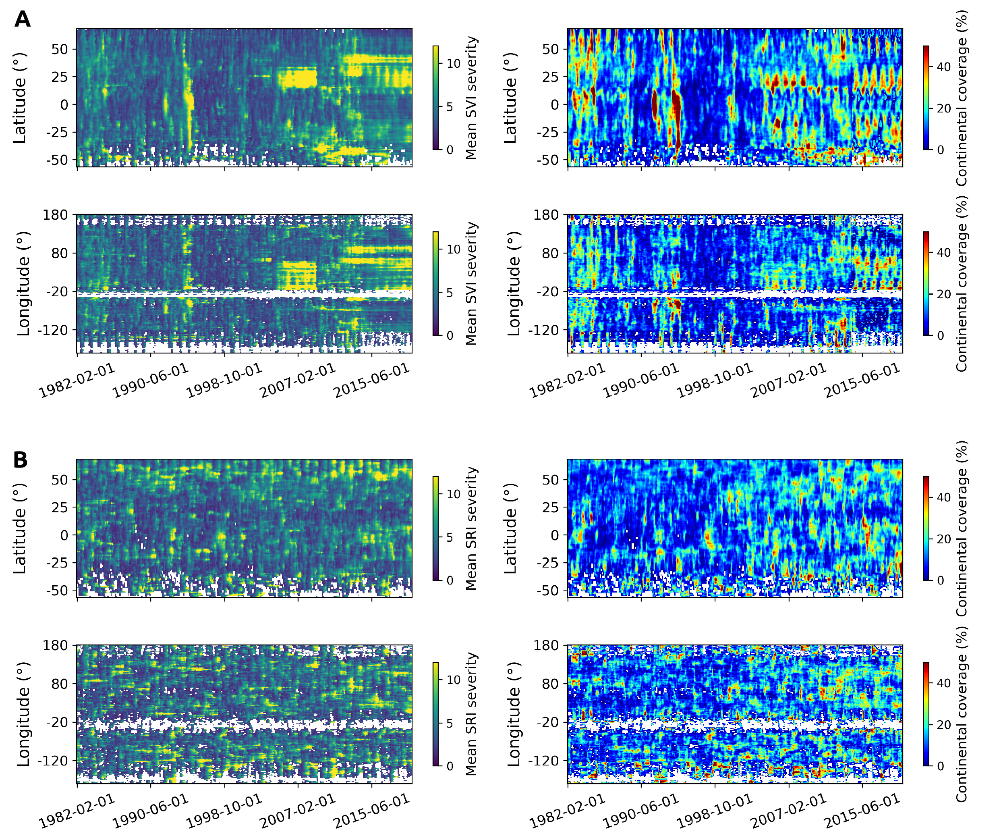

# FES_drought
Code associated with the publication entitled [Spatial and Temporal Global Patterns of Drought Propagation](https://www.frontiersin.org/articles/10.3389/fenvs.2022.788248/full) in **Frontiers in Environmental Science** by Ignacio Fuentes, José Padarian, and R. Willem Vervoort from The University of Sydney


**doi**: https://doi.org/10.3389/fenvs.2022.788248


## About

The Scripts correspond to colab notebooks which require the use of Google Earth Engine (GEE), and they allow to get standardised drought indices using the gamma and log-logistic distibutions for rainfall and rainfal minus evapotranspiration, the z-scores for vegetation, and empirical probabilities based on the Gringorten plotting position for runoff. 

<p align="center">
  
</p>

These can be calculated from hydrometeorological gridded data stored in GEE, including CHIRPS for rainfall, a combination of variables to calculate evapotranspiration from ERA5 and FLDAS, NDVI from AVHRR and MODIS, and runoff from ERA5. However, other datasets can also be used.

<p align="center">
  
</p>

Additionally, a python file for cross-correlation using prewhitened data with ARIMA was also included.

<p align="center">
  
</p>

## How to cite this work?

### Article

```
@article{fuentes2022spatial,
  title={Spatial and temporal global patterns of drought propagation},
  author={Fuentes, Ignacio and Padarian, Jos{\'e} and Vervoort, R Willem},
  journal={Frontiers in Environmental Science},
  volume={140},
  year={2022},
  publisher={Frontiers}
}
```
